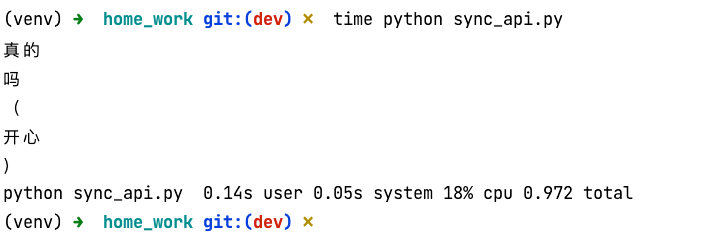
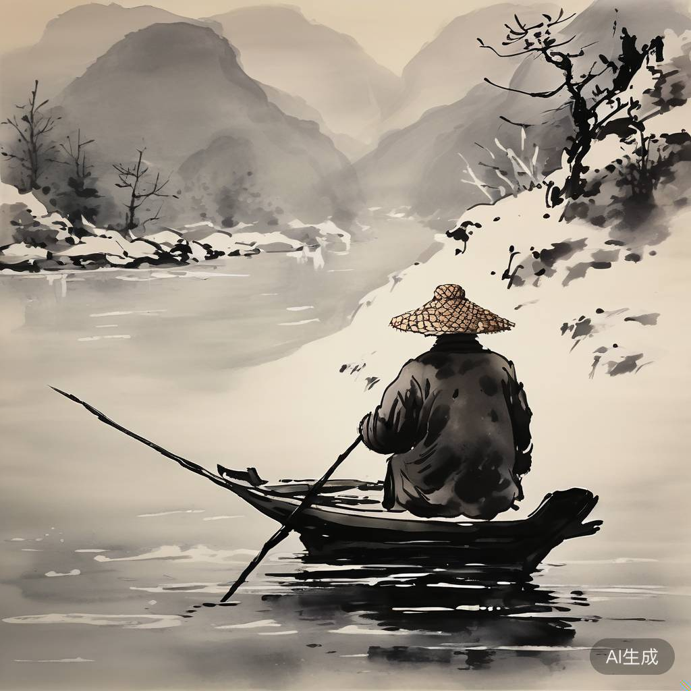
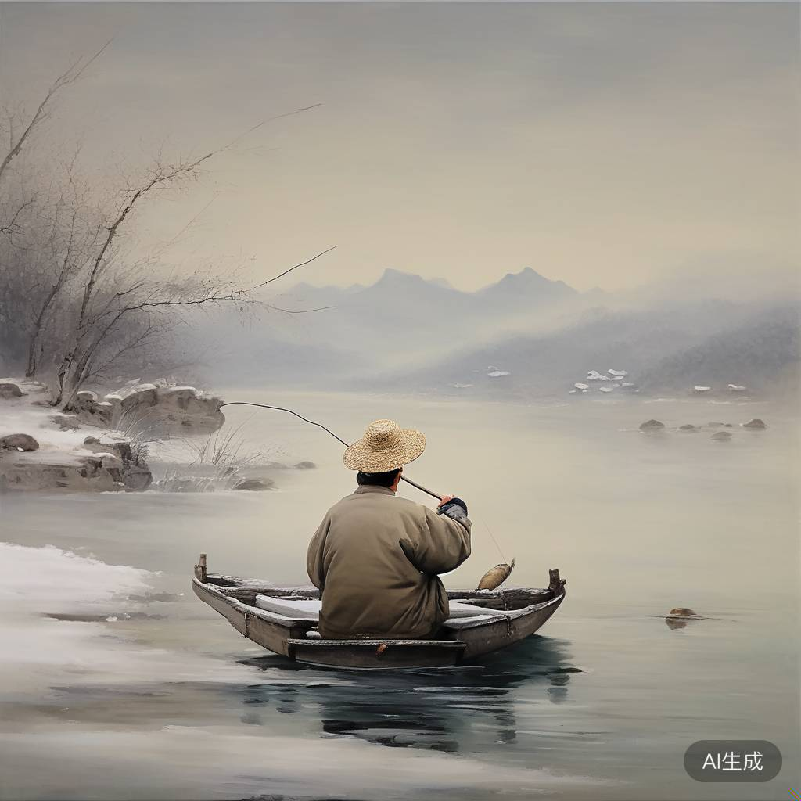

# 要求

作业2-1：为了提高并发数，许多python程序会采用异步方式（async/await）调用API，请尝试实现异步的CharacterGLM API。
提示：可以用aiohttp或httpx等异步请求库代替get_characterglm_response采用的requests库。

作业2-2：尝试修改文生图的prompt，生成不同风格的图片，例如，油画、水墨画、动漫等风格。

# 解答

## 作业2-1
安装库
```bash
pip install aiohttp
```

## 使用异步方案代码
具体见代码: sync_api.py
效果:



## 作业2-2
修改文生图的prompt，生成不同风格的图片，例如，油画、水墨画、动漫等风格。

### 改法
通过修改prompt，可以生成不同风格的图片，例如，油画、水墨画、动漫等风格。
修改文件cogview_example.py
```python
def cogview_example(style="国画", content="孤舟蓑笠翁，独钓寒江雪"):
    image_prompt = f"你是一个绘画大师, 请用{style}风格绘制主题: <<{content}>>"
    image_url = generate_cogview_image(image_prompt)
    
    print("image_prompt:")
    print(image_prompt)
    print("image_url:")
    print(image_url)
```
水墨画效果如下:

油画效果如下:

动漫效果如下:


