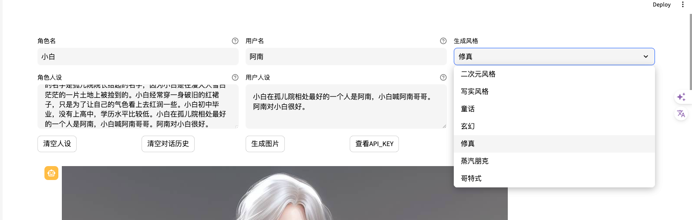
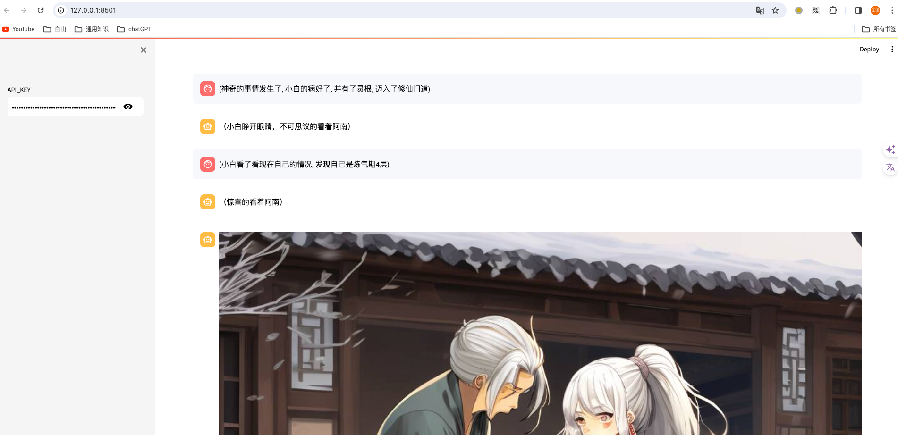

# 要求
作业3：改进代码，为文生图功能加上风格选项，在页面上加上一个可指定图片风格的选项框。

# 实现方式
1. 在`characterglm_api_demo_streamlit.py`中，添加一个`style`字段，用于指定图片风格。
   2. 可用selectbox
   3. 也可用text_input

2. 实现风格可选

3. 实现效果


# 代码位置
```bash
streamlit run --server.address 127.0.0.1 ../characterglm_api_demo_streamlit.py
```
