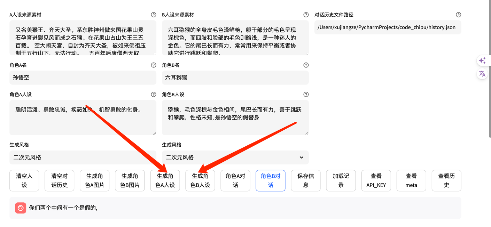
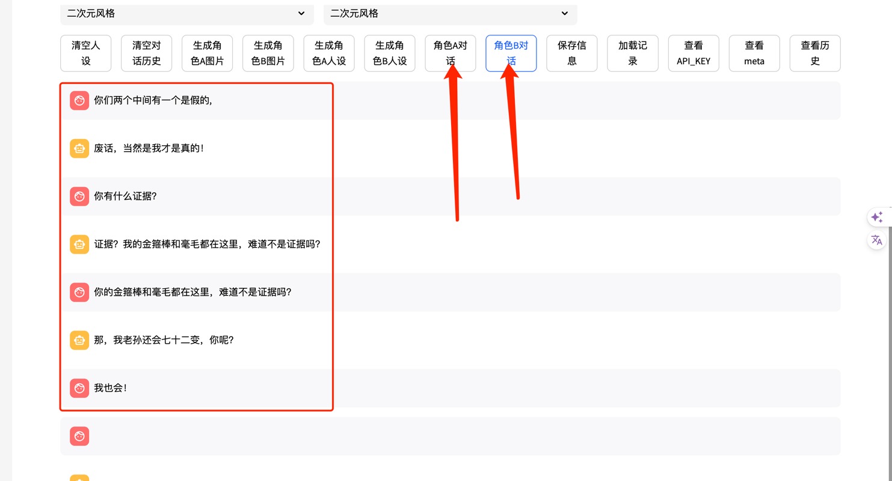
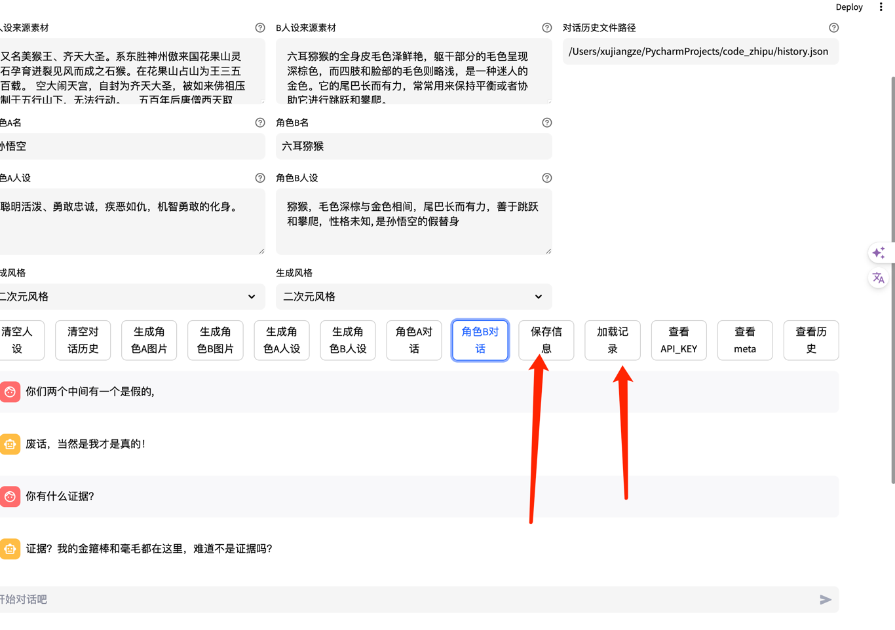

# 智谱要求作业
来源于00-03课程作业.
放置于`homework`目录下.

- [作业1链接](./homework/homework_01.md)
  - 除了`typing.TypedDict`之外，也有其他的库用类型标注的方式完成数据类型定义。 请了解`dataclasses`和`pydantic`的用法， 尝试用`dataclasses.dataclass`或`pydantic.BaseModel`实现`TextMsg`。 思考这三种方式各自有何优缺点。


- [作业2链接](./homework/homework_02.md)
  - 作业2-1：为了提高并发数，许多python程序会采用异步方式（async/await）调用API，请尝试实现异步的CharacterGLM API。提示：可以用aiohttp或httpx等异步请求库代替get_characterglm_response采用的requests库。
  - 作业2-2：尝试修改文生图的prompt，生成不同风格的图片，例如，油画、水墨画、动漫等风格。

- [作业3链接](./homework/homework_03.md)
  - 改进characterglm_api_demo_streamlit.py代码，为文生图功能加上风格选项，在页面上加上一个可指定图片风格的选项框。

# 极客时间作业
## 作业一
改进 characterglm_api_demo_streamlit.py 的代码，为文生图功能加上风格选项，并在页面上加一个可指定图片风格的选项框。
同智谱作业3.

[作业3链接](./homework/homework_03.md)

## 作业二
实现 role-play 对话数据生成工具，要求包含下列功能：
基于一段文本（自己找一段文本，复制到提示词就可以了，比如你可以从小说中选取一部分文本，注意文本要用 markdown 格式）生成角色人设，可借助 ChatGLM 实现。
给定两个角色的人设，调用 CharacterGLM 交替生成他们的回复。
将生成的对话数据保存到文件中。
（可选）设计图形界面，通过点击图形界面上的按钮执行对话数据生成，并展示对话数据。

实现: 见代码
characterglm_autochat.py

启动方式
```bash
streamlit run --server.address 127.0.0.1 characterglm_autochat.py
```

1.基于文本的生成人设

2.交替生成对话

3.保存对话数据, 重新加载

历史数据展示, 可加载历史数据, 并进行上一次对话.
